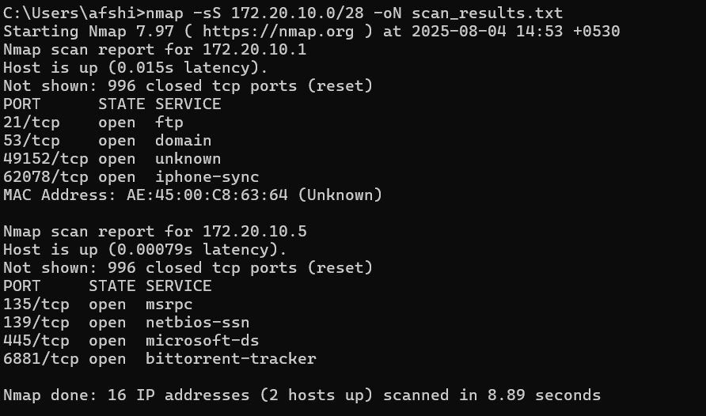

# nmap-network-scan-task
Nmap scan, analysis using Wireshark, and vulnerability review
## 🖼️ Screenshots

### 🔍 Nmap Scan Result


### 🐟 Wireshark Packet Capture

## 🧪 Task Overview

This task involves performing a local network scan using **Nmap**, analyzing traffic with **Wireshark**, and identifying open ports and their potential security risks. It is part of the Elevate Labs Cybersecurity Internship Program.

## ⚙️ Tools Used

- [Nmap](https://nmap.org/) – Network scanner
- [Wireshark](https://www.wireshark.org/) – Network packet analyzer
- Operating System: [Kali Linux](https://www.kali.org/) / Windows (choose yours)

## 📡 Scan Command

```bash
nmap -sS 172.20.10.0/28
## 🔍 Key Findings

### Live Hosts and Open Ports

| IP Address     | Port | Service | Notes                               |
|----------------|------|---------|-------------------------------------|
| 172.20.10.1    | 21   | FTP     | May allow anonymous access          |
|                | 53   | DNS     | DNS cache poisoning risk            |
|                | 49152| RPC     | Used by Windows services            |
|                | 62078| iTunes  | Device sync port, Apple devices     |
| 172.20.10.5    | 135  | MSRPC   | Common in Windows, vulnerable ports |
|                | 139  | NetBIOS | Can be exploited for SMB attacks    |
|                | 445  | SMB     | Critical: WannaCry target           |
|                | 6881 | BT      | BitTorrent, P2P sharing detected    |

## ⚠️ Potential Vulnerabilities

- **FTP (21)** – May allow unauthorized access if not secured
- **SMB Ports (139, 445)** – Known to be exploited by ransomware
- **BitTorrent (6881)** – P2P file sharing can expose system to malware
- **Dynamic/High Ports (49152, etc.)** – Often overlooked but can be exploited

Ensure proper firewall configurations and disable unnecessary services.
<details> <summary>✨ Copy & paste this:</summary>
## 📁 Project Structure
nmap-network-scan-task/
│
├── screenshots/
│ ├── wireshark_capture.png
│ └── scan_result.png
│
├── scan_results.txt
└── README.md 
</details>

